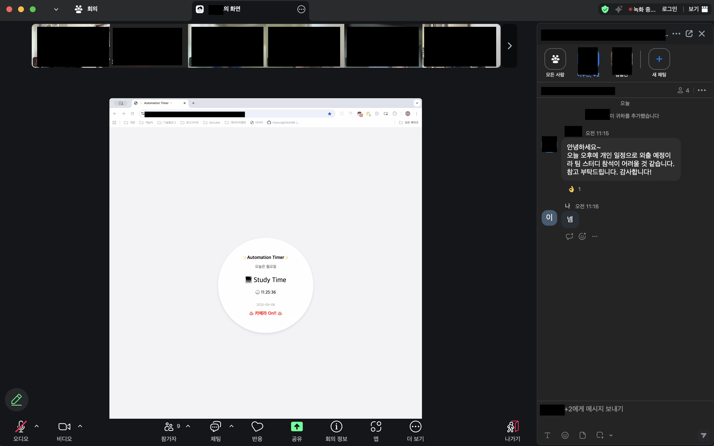

# Whip (위클리 프로젝트 - 위프)

## 🏁 개요

- HTML, CSS, Javascript만 사용해서 일주일에 한 번씩 클론코딩 진행하는 소규모 팀 스터디

## 🙇‍♂️ 참여자

 <table>
    <tr>
      <td align="center"><a href="https://github.com/Kangji-hye"> <b>김지혜</b></a> 
      <td align="center"><a href="https://github.com/zzzRYT"> <b>이재진</b></a>
      <td align="center"><a href="https://github.com/bboroin"> <b>최아로인</b></a>
    </tr>
  </table>

## 학습 목표

- 간단한 페이지의 UI를 클론코딩 해 보면서 HTML,CSS에 대한 숙련도를 높이기
- 간단한 기능 구현을 통해서 Javascript와 친해지기

## 구현 목표

- 본인의 역량에 맞게 ZOOM UI를 구현
